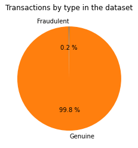

# Imbalanced Classes
In this dataset, the `Class` feature tells us which transactions were deemed to be fraudulent, denoted class 1, and which were deemed genuine, denoted class 0. We can very quickly see that there are vastly more genuine transactions in the dataset than fraudulent ones.

In the vast majority of cases, we will not be able to collect an equal number of points from each class. More unusual events such as spam or fraud are bound to show up less in data that we collect in a random sample. Very often, however, we care a lot more about the unusual events than the usual ones. [1]

When classes are very imbalanced, we should be aware of what can go wrong.

<small>[1] Gary M. Weiss. "Foundations of Imbalanced Learning". In: *Imbalanced Learning: Foundations, Algorithms, and Applications*. 1st ed. Wiley, Hoboken, NJ. (2013)</small>

## Accuracy

In a binary classification problem with imbalanced classes, we can very easily make a classifier that sounds impressive but is in fact trivial. Suppose we'd like to construct a spam filter, and we know that approximately 90% of emails received are not spam. Then by constructing a classifier that considers every e-mail to be genuine, we can attain an *accuracy* of 90%. It isn't hard to see that this is hugely misleading, because the spam filter does absolutely nothing.

On our highly imbalanced dataset, the figures are even more misleading: we can attain an accuracy on the test set of about 99.8% by always labelling a transaction as genuine! It is clear that we need a different metric, because the difference between a bad classifier and the best possible classifier is just a change of 0.2% in the accuracy.

In fact, giving the problem some thought, we realise that the good classifiers in this problem would be a compromise between finding as many of the fraudulent cases as possible, and keeping the number of false positives as low as possible. The former can be measured by the *precision* metric. Recall that, in our context, this represents the number of fraud predictions that actually were fraud. This takes values between 0 (every case we flagged as fraud was actually genuine) and 1 (every case we flagged as fraud was fraudulent). Ideally, we want this to be as high as we can get. 

The latter can be measured by *recall* of a classifier. This represents the fraction of fraudulent cases in the dataset that we correctly identify, and could also be called the *true positive rate*. Again, this takes values between 0 and 1, and we can trivially obtain a value of 1 by identifying every transaction as fraudulent. Such a classifier would have very low (but non-zero) precision as most of its predictions were wrong.

While we are talking about binary classification (i.e. building a model to decide whether a transaction is *fraud* or *genuine*), the models we will explore don't simply give a value on the dichotomy. Instead, they use some sort of decision function or threshold. If we vary this cutoff, we can achieve different levels of precision and recall; for example, we might be able to sacrifice some precision but correctly recall a higher percentage of fraudulent transactions. These choices can be explored using the *precision–recall curve* and the *receiver operating characteristic curve*.

### Metrics
Let \\(h \colon \mathcal{X} \to \mathcal{Y} = \\{0, 1\\}\\) be a classifier. We can formally define the recall metric with respect to a set of data \\(D = \\{ (x_1, y_1), \dots, (x_n, y_n) \\}\\) as
\\[ \mathrm{Recall}(h; D) = \sum_{i = 1}^n \frac{\mathbf{1} \\{ h(x_i) = 1 \cap y_i = 1\\}}{\mathbf{1} \\{ y_i = 1\\}}.\\]
Likewise, precision is defined as
\\[ \mathrm{Precision}(h; D) = \sum_{i = 1}^n \frac{\mathbf{1} \\{ h(x_i) = 1 \cap y_i = 1\\}}{\mathbf{1} \\{ h(x_i) = 1\\}}.\\]
In other words, precision estimates the probability that if \\(Y = 1\\) given \\(h(X) = 1\\). Recall estimates the probability that a given fraudulent transaction is detected.
### ROC and Precision–Recall
The *receiver operating characteristic* (ROC) curve for a classifier compares the true and false positive rate for different thresholds of the classifier. The graph plots the false positive rate on the x-axis against the true positive rate on the y-axis, and the ideal classifier is represented by the point (0, 1). 

The *precision–recall* curve for a classifier plots the recall on the x-axis against the precision on the y-axis. The ideal classifier in this case is represented by the point (1, 1). Poor classifiers are ones with low precision or low recall. 

In fact, the two curves are rather intimately related [2]. If a classifier *dominates* the precision–recall space, in other words if the curve lies strictly above any other curve at all points, then it also dominates in ROC space. There is some debate whether the ROC curve or precision–recall curve should be preferred on imbalanced binary classification problems [3].

Here are some examples of ROC and precision–recall curves. These were **not** generated from the same dataset, but give an idea of what to expect when plotting these curves for two different classifiers.

<small>[2] Jesse Davis and Mark Goadrich. "The relationship between Precision-Recall and ROC curves". In: <i>Proceedings of the 23rd international conference on Machine learning</i> (<i>ICML '06</i>). Association for Computing Machinery, New York, NY, USA, pp. 233–240.  (2006). [DOI](https://doi.org/10.1145/1143844.1143874)</small> 
<small>[3] Takaya Saito and Marc Rehmsmeier. *The precision-recall plot is more informative than the ROC plot when evaluating binary classifiers on imbalanced datasets*. PloS One 10.3, e0118432. (2015). [DOI](https://doi.org/10.1371/journal.pone.0118432).</small>

## Models
Imbalanced classes can be more difficult to learn for some models. An example of a model that might struggle is a \\(k\\)-nearest-neighbour classifier [4]. Depending on the geometry of the dataset, the larger class may dominate any predictions simply because there are so many more, but if we had a more balanced set, the minority class would be more easily predicted. 

There are often adaptations to the models we use which are intended to be able to deal with imbalanced classes more easily, such as weighting the neighbours as proposed in [4]. As discussed in the final section of the book, there are other approaches we could consider in order to balance the dataset in a model-agnostic way, such as *oversampling* or synthetic generation of new data.

<small>[4] Songbo Tan. *Neighbor-weighted K-nearest neighbor for unbalanced text corpus*. Expert Systems with Applications 28.4, pp. 667–671. [DOI](https://doi.org/10.1016/j.eswa.2004.12.0230). (2005).</small>