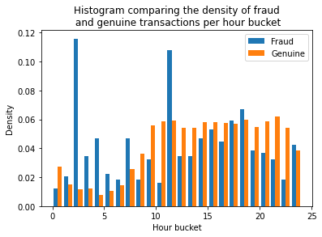

# Seasonality
We'll take a closer look at the `Time` feature in this section. Time series data is often interesting and is present is many datasets from various domains. The archetypal example for time series data is stock market pricing, where we want to predict the price of a stock at time \\(T\\) given knowledge of all times \\(t \leq T\\). 

## Fraud and Time
Intuitively, we might expect the fraud rate to vary over the course of a day. Perhaps fraudsters prefer to operate at night when the cardholder is asleep? Or, it might be the case that genuine transactions occur less at night, so the chance of a transaction being fraud increases.

In our dataset, we are given the `Time` variable, which measures the time elapsed since the first transaction in the dataset. We don't know the date or time that the first transaction occurred, so we can't meaningfully reconstruct the times of each transaction. We can, however, break the data into 24 bins, each representing the number of hours (modulo 24) since the start of the dataset. 
```python
{{#include ../../src/hours.py}}
```


The data here represents the *density* of transactions, so we must bear in mind that in the observed data, genuine transactions will still be more common in every hour, but relatively speaking, the fraudulent transactions are a greater share of the total transactions in some hours (e.g. hours 1—7, where we see a large decline in genuine transactions and increase in fraudulent transactions).

We should certainly expect the `Time` feature to be useful in the models that we construct, but it might be hard for learners to discover the seasonality pattern. We might need to encode this feature differently ourselves for the model to take full advantage of it. 