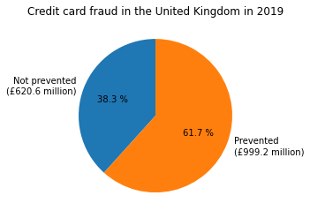

## Background
In the UK, fraud losses totalled £620.6 million in 2019, with 2,745,539 recorded incidents occurring in that year alone [1, p. 13]. Over 98% of these losses were absorbed by banks and card issuers, and the remaining losses were paid by cardholders. 

These losses represent a huge problem in the form of lost profit and increased overhead costs for cardholders. Even small advances in the accuracy of fraud detection systems would cut down on these losses.

There is certainly opportunity for improvement: while £999.2 million of fraudulent transactions were prevented by banks [1], this only accounts for about 62% of losses.

If one further percentage point of fraud could be prevented, this would reduce fraud losses by approximately £16 million (as of 2019) [1]. 

On the other hand, the savings in reduced fraud may not be worth it if this leads to increased payment friction. Inconvenience and declined card transactions also lead to lost business, so a compromise is needed.

<small>[1] UK Finance. <i>Fraud — The Facts 2020</i>. [URL](https://www.ukfinance.org.uk/system/files/Fraud-The-Facts-2020-FINAL-ONLINE-11-June.pdf).</small>