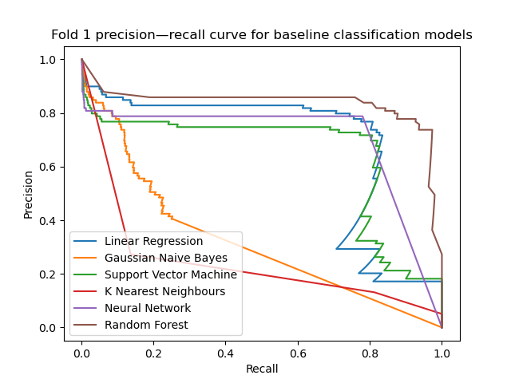
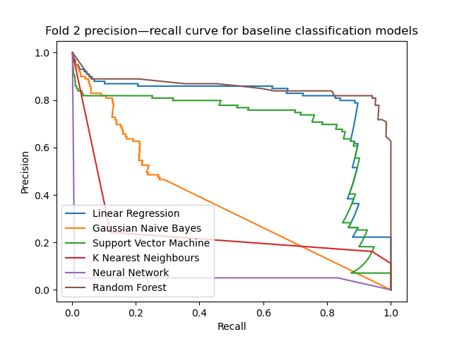
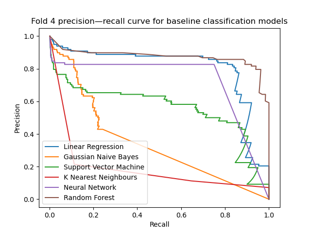
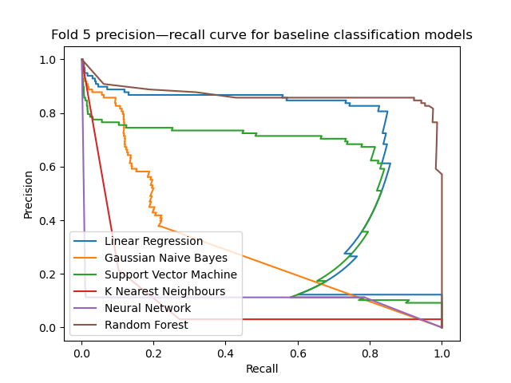

# Baseline Model
We're now ready to evaluate some models and see which seem to be most promising. We'll then take the models that perform best, try to understand why, and work to improve these models even further.

As we discussed previously, we will perform cross-validation using a stratified \\(k\\)-fold method. As discussed in the [Exploratory Data Analysis](eda_classes.html), we will compare the classifiers using the precision–recall curve and the *average precision score*, which represents the area under the curve. The score gives us a single number to summarise the curve, and roughly speaking, larger scores are better.

We will try a broad variety of "off-the-shelf" models which should give us a reasonable idea about which models are promising. In particular, we will try:
- **linear regression** models;
- **random forest** ensemble models;
- **neural network** models;
- **neighbour** models;
- **support vector machine** models; and
- **naive Bayes** models.

```python
{{#include ../../src/baseline.py}}
```
### Output






We see that the random forest classifier achieves the greatest area under the curve on every fold. The linear models are fairly 
consistent and never perform too badly. An interesting case is the neural network, which tended to learn well on some folds, and on others performed extremely poorly. This might be because the training algorithm (which uses backpropagation behind the scenes) is finding a local minimum which turns out to be particularly poor.

We'll certainly want to consider the random forest model going forward, but some experimentation might be needed in order to obtain good results from the other models.

In the next section, we'll begin to preprocess the data by scaling it. This should prove to be an easy step which vastly increases the performance of some of our models.