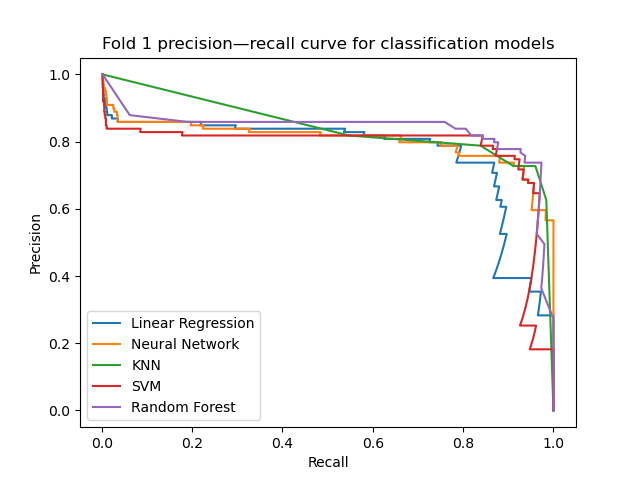
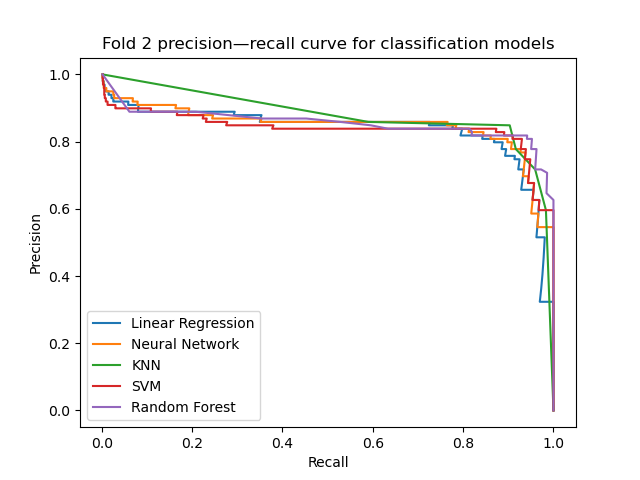
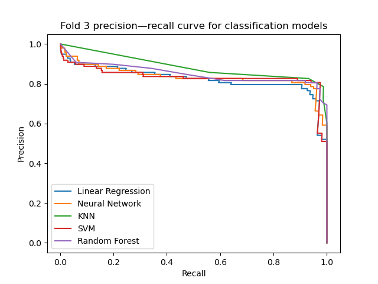
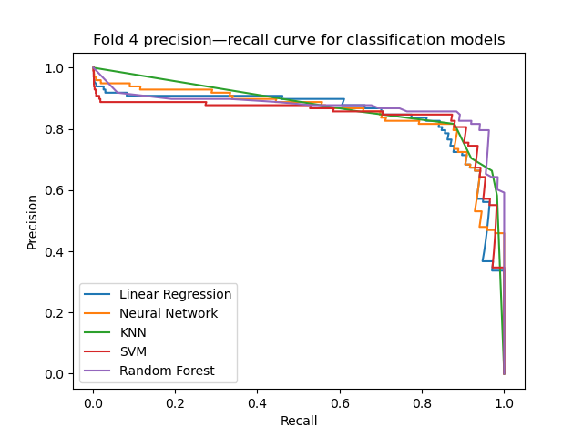
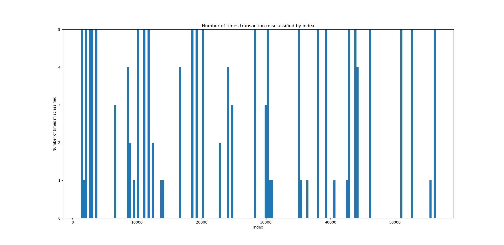

# Ensembles
In the previous sections we've developed several models which all perform reasonably well. 
```python
{{#include ../../src/model_comparison.py}}
```






All of these models are broadly comparable. The random forest still proves hard to beat, but generally the models all perform broadly 
equivalently.

We might now consider what's going wrong with these classifiers: which transactions cause problems? If they all fail on the same transactions, this might just mean they're difficult to learn. If not, we might be able to combine the learners into one which is more powerful than any individual classifier.

## Errors
We investigate the idea we just mentioned: do the classifiers tend to predict the label incorrectly on the same transactions?
```python
{{#include ../../src/model_errors.py}}
```

We can see that using the predictions of multiple classifiers, quite a few of the misclassifications can be avoided. Further investigation indeed shows that while some transactions are classified wrong by nearly all the models (which we might suspect are "hard" to classify), others are modelled better by some learners than others.  
## Hard Voting
One way of combining the learners is to use scikit-learn's `VotingClassifier`. In effect, we construct multiple independent models, get a prediction from each, and choose the most common label. If there's a tie, we choose the majority class. This method is known as *hard voting*, and only requires classifiers that assign labels in \\(\\{0, 1\\}\\). The `VotingClassifier` also supports an alternative method known as *soft voting*, but this works best for classifiers which output predictions in \\([0, 1]\\) calibrated to probability estimates.

```python
{{#include ../../src/model_voting.py}}
```

### Output
```
Precision: 0.948
Recall: 0.737
f-score: 0.830
```
The voting classifer has a precision of 0.95 and a recall of 0.74. This means that almost all of the fraudulent cases flagged by the classifier are correct, at a cost of missing a larger fraction of the true fraud. Depending on business parameters, this might be preferable to a very high recall; we can easily obtain a recall in excess of 0.95 with the individual models, but precision is much lower. Depending on whether it is worse to miss fraud or falsely flag genuine transactions, we can choose the appropriate model.